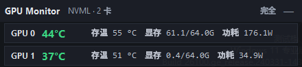
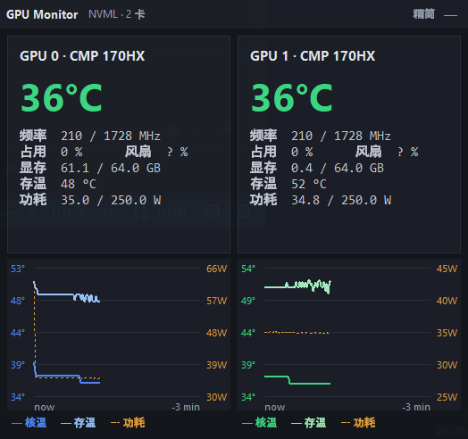
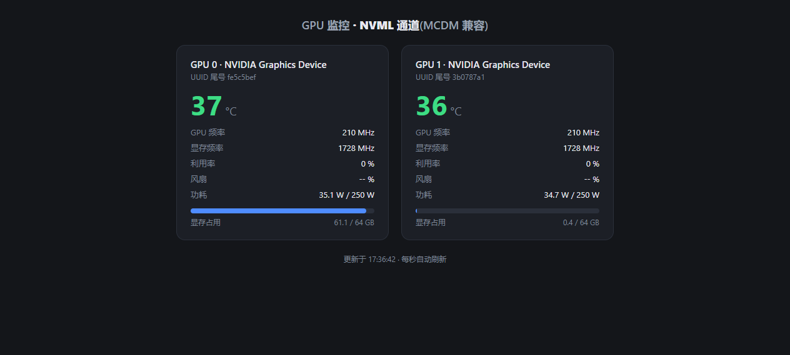

# GPU Monitor

[](https://github.com/hongguifeng/cmp170hx-gpu-monitor/actions/workflows/build-exe.yml)

针对 **CMP 170HX × 2（MCDM 模式）** 的显卡监控小工具。

在 MCDM 模式下，基于 NVAPI 的工具（GPU-Z、LibreHardwareMonitor 等）**完全看不到显卡**。
本工具走 **NVML 通道**（与 `nvidia-smi` 同源），稳定读取核心温度、HBM 存温、功耗、显存占用等指标，
并能在驱动被卸载/重装（如解锁流程会反复拆装 NVIDIA 驱动）后自动重连恢复。

## 界面预览

系统托盘图标 —— 始终显示**最热显卡**的温度，并按温度变色
（绿 &lt; 68°C · 橙 ≥ 68°C · 红 ≥ 80°C）：


悬浮置顶小窗 · 精简模式（一行一卡，常驻不挡视线）：



悬浮置顶小窗 · 完全模式（每卡一张卡片 + 3 分钟温度/存温/功耗曲线）：



网页仪表盘（`gpu-monitor.py`，可选，见下文）：



## 功能特性

- **托盘常驻**：图标实时显示最高温；单击托盘 = 显示 / 隐藏悬浮窗
- **悬浮置顶窗**：可拖动标题栏移动；`—` 隐藏；「精简 / 完全」两种布局可切换，偏好跨重启持久化（`compact.flag`）
- **每卡读取**（NVML）：名称、核心温度、GPU/显存频率、利用率、风扇、显存占用、实时功耗与功耗上限
- **HBM 存温**：NVML 的 `TEMPERATURE_MEMORY` 在本平台返回 `NOT_SUPPORTED`，改由常驻 `nvidia-smi -l 1` 流式进程解析 `temperature.memory`（条目 5 秒过期，杜绝"冻结"的假温度）
- **抗驱动拆装**：三路自愈 —— 全部读数死亡、部分卡退化、NVML 设备列表过期（借 nvidia-smi 新枚举交叉校验），均会触发 NVML 强制重建，驱动重装后监控自动回归
- **开机自启**：托盘菜单勾选写入 `HKCU\...\Run`，可随驱动重连
- **看门狗**：`watchdog.ps1` 每 10 秒查活，进程意外死亡自动拉起；通过托盘「退出」写入 `no-restart.flag` 后看门狗尊重退出意图
- **崩溃黑匣子**：`faulthandler` + 全局 excepthook，硬崩溃与未捕获异常均落入 `monitor.log`
- **单实例**：命名互斥体防止重复启动互相干扰

## 使用方法

### 托盘版（推荐）

直接双击运行 `GPU-Monitor.exe`（免安装、免 Python）。
首次运行建议在托盘菜单勾选「开机自启」。

### 从源码运行

```bash
pip install pystray pillow
python gpu-monitor-tray.py
```

### 网页仪表盘（可选的第二形态）

```bash
python gpu-monitor.py
# 或隐藏控制台启动：双击 start-gpu-monitor.vbs
```

浏览器打开 <http://127.0.0.1:8765>，每秒自动刷新，展示温度、频率、利用率、
风扇、功耗/上限、显存占用进度条与 UUID 尾号。

## 文件说明

| 文件 | 作用 |
| --- | --- |
| `gpu-monitor-tray.py` | 主程序：托盘 + 悬浮窗 + NVML/nvidia-smi 自愈逻辑 |
| `gpu-monitor.py` | 轻量变体：NVML → 本地 Web 仪表盘（端口 8765） |
| `watchdog.ps1` | 看门狗：进程死亡自动重启 |
| `start-gpu-monitor.vbs` | Web 仪表盘的隐藏式启动器 |
| `GPU-Monitor.spec` | PyInstaller 打包配置 |
| `monitor.ico` | 应用图标 |
| `GPU-Monitor.exe` | 打包产物（未纳入 git） |

## 排障

运行期诊断信息（NVML 重连、GPU 数量变化、强制重建原因、崩溃栈）都追加写入
`monitor.log`，出问题时先看这个文件。

## 重新构建

```bash
pip install pyinstaller pystray pillow
pyinstaller GPU-Monitor.spec
```

产物为 `dist/GPU-Monitor.exe`，可替换根目录的旧 exe。

## GitHub CI 构建

仓库内置 `.github/workflows/build-exe.yml`：推送到 `master`、提 PR 或手动触发（Actions →
「Build Windows EXE」→ Run workflow）都会在 `windows-latest` 上用 PyInstaller 按
`GPU-Monitor.spec` 打包，并把 `dist/GPU-Monitor.exe` 作为名为 **GPU-Monitor-windows** 的
artifact 保留 30 天。没有本机环境也能在 Actions 运行页的 Artifacts 区下载 exe 直接使用。

## 已知限制

- 曲线窗口为最近 **3 分钟**（180 个每秒采样点）
- `风扇 %` 在部分 BIOS/驱动组合下不可用（显示 `-- %`）
- 悬浮窗为无边框窗口（`overrideredirect`），仅标题栏可拖动
